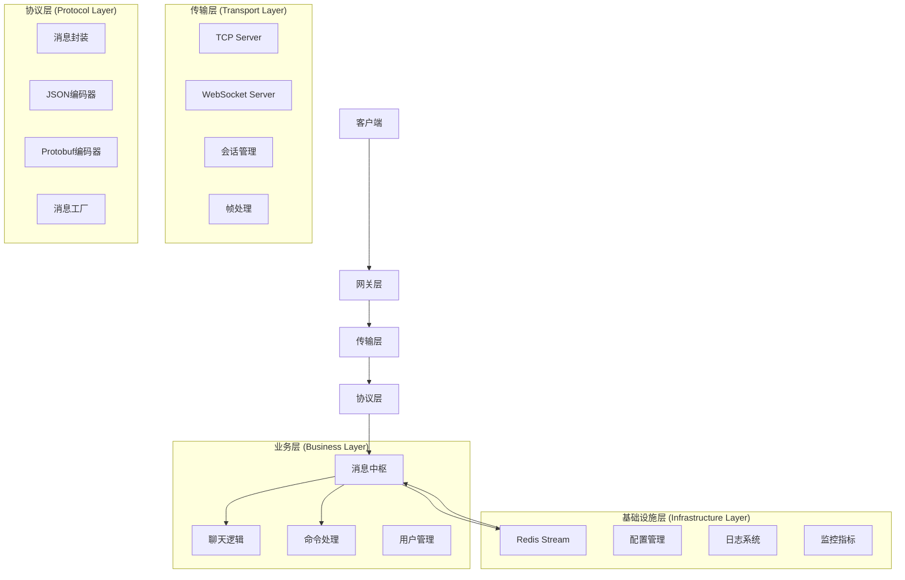

# Chat-Go 架构设计深度分析

## 🏛️ 系统架构概览

### 整体架构图



## 🔧 设计模式分析

### 1. 工厂模式 (Factory Pattern)

**实现位置**: `internal/protocol/message_factory.go`

**优点**:
- 统一消息创建逻辑
- 自动处理通用字段 (ID, 时间戳等)
- 易于扩展新消息类型

**改进建议**:
```go
// 添加消息验证
func (f *MessageFactory) CreateTextMessage(text string) (*Envelope, error) {
    if len(text) == 0 {
        return nil, errors.New("text cannot be empty")
    }
    if len(text) > maxTextLength {
        return nil, errors.New("text too long")
    }
    // ... 创建逻辑
}
```

### 2. 策略模式 (Strategy Pattern)

**实现位置**: `internal/protocol/codec.go`

**设计亮点**:
```go
type MessageCodec interface {
    Name() string
    Encode(w io.Writer, m *Envelope) error
    Decode(r io.Reader, m *Envelope, maxSize int) error
}
```

**优点**:
- 编码算法可插拔
- 运行时选择编码方式
- 易于添加新编码格式

### 3. 网关模式 (Gateway Pattern)

**实现位置**: `internal/transport/gateway.go`

**设计特点**:
```go
type Gateway interface {
    OnSessionOpen(sc *SessionContext)
    OnEnvelope(sc *SessionContext, msg *protocol.Envelope)
    OnSessionClose(sc *SessionContext)
}
```

**优点**:
- 统一处理会话生命周期
- 解耦传输层和业务层
- 支持多种传输协议

### 4. 观察者模式 (Observer Pattern)

**实现位置**: `internal/chat/hub.go`

**设计特点**:
```go
func (h *Hub) Subscribe(t EventType, fn EventHandler) 
func (h *Hub) Emit(event Event)
```

**优点**:
- 事件驱动架构
- 松耦合的组件通信
- 易于扩展事件处理

## 📊 性能优化设计

### 1. 对象池模式

**实现位置**: `internal/transport/frame.go`

```go
type FrameCodec struct {
    bufPool *sync.Pool
}

func NewFrameCodec() *FrameCodec {
    return &FrameCodec{
        bufPool: &sync.Pool{
            New: func() any {
                return make([]byte, 64*1024)
            },
        },
    }
}
```

**优化效果**:
- 减少内存分配
- 降低 GC 压力
- 提高处理性能

### 2. 零拷贝优化

**设计理念**: 
- TCP 帧处理避免不必要的内存拷贝
- 缓冲区复用机制
- 流式处理减少内存占用

### 3. 并发安全设计

**同步机制**:
```go
// 读写锁保护
readMu  sync.Mutex
writeMu sync.Mutex

// 原子操作
state   int32
closed  int32
```

## 🔍 错误处理架构

### 1. 分层错误处理

**传输层错误**:
```go
var (
    ErrSessionClosed   = errors.New("session is closed")
    ErrSessionNotFound = errors.New("session not found")
    ErrInvalidFrame    = errors.New("invalid frame format")
)
```

**协议层错误**:
```go
func (JSONCodec) Decode(r io.Reader, e *Envelope, maxSize int) error {
    if err := dec.Decode(e); err != nil {
        return fmt.Errorf("json decode: %w", err)
    }
    if e.Type == "" {
        return fmt.Errorf("missing field: type")
    }
    return nil
}
```

### 2. 错误恢复机制

**连接恢复**:
- 心跳检测机制
- 自动重连逻辑
- 优雅降级处理

## 🔐 安全架构分析

### 当前安全措施

1. **输入验证**:
   - 帧大小限制
   - 消息格式验证
   - 类型检查

2. **资源保护**:
   - 连接数限制
   - 超时控制
   - 内存使用限制

### 安全缺陷

1. **缺少认证机制**:
   - 没有用户身份验证
   - 缺少权限控制
   - 无会话安全性保证

2. **数据传输安全**:
   - 明文传输
   - 无消息签名验证
   - 缺少重放攻击防护

### 安全改进方案

```go
// 建议的认证接口
type Authenticator interface {
    Authenticate(token string) (*User, error)
    Authorize(user *User, action string) bool
}

// 建议的加密接口
type Encryptor interface {
    Encrypt(data []byte) ([]byte, error)
    Decrypt(data []byte) ([]byte, error)
}
```

## 📈 可扩展性设计

### 1. 水平扩展支持

**分布式消息总线**:
```go
// Redis Stream 实现
type Bus struct {
    cli    *redis.Client
    stream string
    group  string
}
```

**优点**:
- 支持多实例部署
- 消息持久化
- 高可用性

**改进方向**:
- 添加分区支持
- 实现消息路由
- 支持集群模式

### 2. 垂直扩展能力

**模块化设计**:
- 协议层可插拔
- 传输层抽象化
- 编码器可扩展

**扩展示例**:
```go
// 添加新的传输协议
type QUICServer struct {
    addr string
}

func (s *QUICServer) Start(ctx context.Context, addr string, gateway Gateway, opt Options) error {
    // QUIC 协议实现
}

// 添加新的编码格式
type MsgpackCodec struct{}

func (MsgpackCodec) Encode(w io.Writer, m *Envelope) error {
    // Msgpack 编码实现
}
```

## 🎯 架构优势总结

### 1. 清晰的分层架构
- 职责分离明确
- 依赖关系清晰
- 易于理解和维护

### 2. 高度可扩展性
- 接口驱动设计
- 组件可插拔
- 支持多种协议

### 3. 良好的性能设计
- 对象池优化
- 零拷贝机制
- 并发友好

### 4. 现代化架构模式
- 事件驱动
- 微服务友好
- 云原生兼容

## 🔄 架构改进建议

### 短期改进
1. 完善错误处理机制
2. 添加配置验证
3. 统一日志格式
4. 增强测试覆盖

### 中期改进
1. 实现认证授权
2. 添加 TLS 支持
3. 完善监控体系
4. 优化性能瓶颈

### 长期改进
1. 支持更多协议 (gRPC, HTTP/2)
2. 实现服务发现
3. 添加管理界面
4. 云原生部署优化

---

**总结**: Chat-Go 的架构设计体现了现代分布式系统的最佳实践，具有良好的可扩展性和可维护性。通过持续的改进和优化，可以发展成为一个企业级的实时通信解决方案。